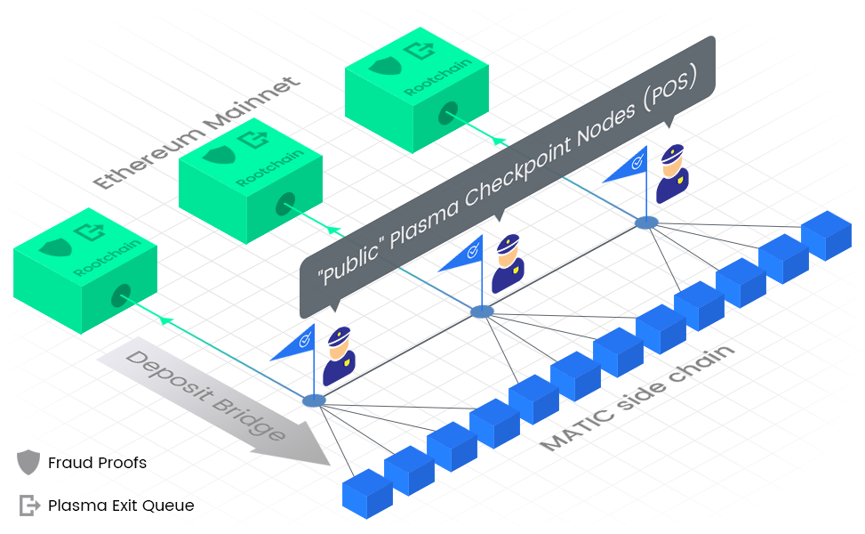

# Architecture

## Polygon 

Polygon PoS is an Ethereum-based, Proof-of-Stake and Plasma-enabled hybrid sidechain whose sub-second finality times and extremely low fees provide dApps with an unparalleled user experience.

On top of a distributed consensus layer powered by various checkpoint nodes and an application/execution layer that can achieve up to 2^16 transactions per second, Polygon PoS is fully compatible with Ethereum.

As a hybrid chain, the Polygon PoS chain maintains its liveliness while being able to support any arbitrary transactions at lightning speeds. Polygon also has reduced the time it takes to bridge funds to and from the Ethereum mainnet.

To enable the PoS mechanism on our platform, a set of **staking** management contracts are deployed on Ethereum, as well as a set of incentivized validators running **Heimdall** and **Bor** nodes. Ethereum is the first basechain Polygon supports, but Polygon intends to offer support for additional basechains (such as Zero or Miden) based on community suggestions and consensus to enable an interoperable decentralized Layer 2 blockchain platform.

Polygon has a three-layer architecture:

1. Staking and Plasma smart contracts on Ethereum
2. Heimdall (Proof of Stake layer)
3. Bor (Block producer layer)

#### Polygon smart contracts (on Ethereum) 

Polygon maintains a set of smart contracts on Ethereum, which handle the following:

* Staking management for the Proof-of-Stake layer
* Delegation management including validator shares
* Plasma contracts for MoreVP, including checkpoints/snapshots of sidechain state

#### Heimdall (Proof-of-Stake validator layer) 

**Heimdall** is the PoS validator node that works in consonance with the Staking contracts on Ethereum to enable the PoS mechanism on Polygon. We have implemented this by building on top of the Tendermint consensus engine with changes to the signature scheme and various data structures. It is responsible for block validation, block producer committee selection, checkpointing a representation of the sidechain blocks to Ethereum in our architecture, and various other responsibilities.

Heimdall layer handles the aggregation of blocks produced by Bor into a Merkle tree and publishing the Merkle root periodically to the root chain. This periodic publishing is called `checkpoints`. For every few blocks on Bor, a validator (on the Heimdall layer):

1. Validates all the blocks since the last checkpoint
2. Creates a Merkle tree of the block hashes
3. Publishes the Merkle root to the main chain

Checkpoints are important for two reasons:

1. Providing finality on the Root Chain
2. Providing proof of burn in withdrawal of assets

A bird’s eye view of the process can be explained as:

* A subset of active validators from the pool is selected to act as block producers for a span. The Selection of each span will also be consented by at least ⅔ in power. These block producers are responsible for creating blocks and broadcasting it to the remaining of the network.
* A checkpoint includes the root of all blocks created during any given interval. All nodes validate the same and attach their signature to it.
* A selected proposer from the validator set is responsible for collecting all signatures for a particular checkpoint and committing the same on the main-chain.
* The responsibility of creating blocks and also proposing checkpoints is variably dependent on a validator’s stake ratio in the overall pool.

#### Bor (Block Producer Layer) 

Bor is Polygon's block producer layer - the entity responsible for aggregating transactions into blocks. Currently, it is a basic Geth implementation with custom changes done to the consensus algorithm.

Block producers are periodically shuffled via committee selection on Heimdall in durations termed as a `span` in Polygon. Blocks are produced at the **Bor** node and the sidechain VM is EVM-compatible. Blocks produced on Bor are also validated periodically by Heimdall nodes, and a checkpoint consisting of the Merkle tree hash of a set of blocks on Bor is committed to Ethereum periodically.

#### **📜Resources** 

📎 Bor Architecture: [https://forum.matic.network/t/matic-system-overview-bor/126](https://forum.matic.network/t/matic-system-overview-bor/126)\
📎 Heimdall Architecture: [https://forum.matic.network/t/matic-system-overview-heimdall/125](https://forum.matic.network/t/matic-system-overview-heimdall/125)\
📎 Checkpoint Mechanism: [https://forum.matic.network/t/checkpoint-mechanism-on-heimdall/127](https://forum.matic.network/t/checkpoint-mechanism-on-heimdall/127)

\
